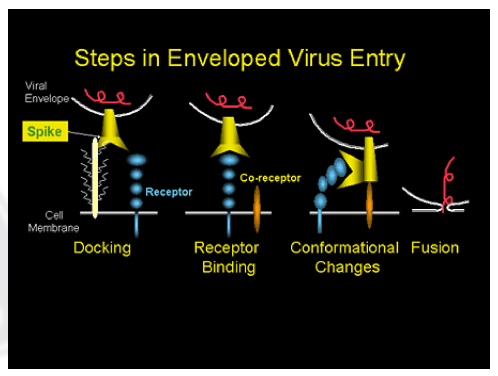

# SARS-CoV-2病毒病理过程的新思路

SARS-CoV-2 病毒对免疫系统的侵扰并引起失控，是其引起患者死亡的关键原因。本文试图根据针对SARS-CoV及MERS-CoV的研究发现，探讨新冠病毒对细胞免疫过程的干扰造成的奇怪的病理过程。

对于新冠病毒的感染细胞的方式，大家的注意力的焦点大都放在ACE2受体上。其侵入ACE2活性强的上皮细胞的过程，已经研究得相当透彻。本文重点探讨另外一种病毒入侵方式：免疫细胞的不完全吞噬。

对比图一新冠病毒与图二腺病毒的结构，这两种病毒在包括遗传物质的壳膜的上有一个显著的区别，就是新冠病毒具有一个层外套膜（Envelope），腺病毒则没有。外套膜的有无，造成了这两种病毒不同的入侵机制和逃逸机制。病毒要想启动复制过程，遗传物质必须从壳体中出来才行。新冠状病毒通过S蛋白与ACE2受体结合后，贴到宿主细胞表面，M蛋白溶解自己的外壳与细胞的接触面，然后把遗传物质挤进去，并与E蛋白协同形成一种囊泡结构，最终在细胞中释放。由于新冠病毒是正链RNA，进入细胞后可以迅速启动自我复制过程。腺病毒则是采用人类细胞的蛋白质转运机制，把自己伪装成为细胞所需要的特种蛋白蒙混过关的。然后在转运过程中，借助细胞免疫机制及溶酶体，逐步分解蛋白外壳。由于腺病毒是DNA病毒，最终病毒遗传物质需要侵入细胞核，启动复制过程。在细胞中复制组装完成的新病毒，通过不同的方式从细胞逃逸。新冠病毒会借助细胞内的高尔基体转运，以出芽方式温和地从细胞膜脱出，保证被感染的细胞生存并持续产生新病毒。而腺病毒则通过触发细胞核膜及细胞膜的裂解，引起细胞破裂死亡，然后从细胞中逃逸出来。

图一，新冠状病毒

图二，腺病毒

再看一下图三，病毒届的忍者神龟：水痘病毒。除了有新冠病毒的外套膜（Envelope），还有第二层被膜（Tegument），甚至具备非常浓厚的核衣壳（Nucleocapsid）。在这三级壳膜层层保护下，这个病毒甚至可以终生潜伏在人体内，在人体免疫系统低下时，趁机出来兴风作浪。水痘病毒侵入细胞的机制与腺病毒类似，利用细胞的蛋白质介导内吞到细胞内，并通过细胞转运至细胞核的过程中慢慢溶解破壳。

图三，水痘带状疱疹病毒

对比完三种病毒入侵细胞的机制，我们可以做一个简单的结论：在表达受体活跃的密集细胞区域，新冠状病毒最快启动复制过程，起病更急，潜伏期更短。而实际上，以温和出芽逃逸策略的新冠病毒，为了长时间劫持人体细胞作为其繁殖机器，具备了调节细胞免疫反应的能力，可以控制细胞内部免疫因子的生产与传输。这个能力由N蛋白及几种功能不详的辅助蛋白调控。一方面沉默了细胞的报警机制，一方面还要利用细胞对外向免疫细胞传达抗原蛋白的机制，大量运送新生产的病毒到细胞膜外。新冠病毒复制过程中会产生大量N蛋白，对细胞免疫系统影响很大。估计病毒新司机很难调控好，也是造成疫情初期病毒致死率高的一个重要原因。

我们再看看刚刚入侵人体时，免疫系统的对抗过程的差异。这三种病毒侵入人体后，非特异抗体迅速行动，标记这些病原体，引导白细胞（主要是中性粒细胞）吞噬掉被抗体沾附的病毒。在白细胞内吞体中，单纯对比三种病毒的结构，腺病毒因为没有外套膜，最先被溶酶体消灭，其次就是新冠病毒，最后是水痘病毒。而实际情况更加复杂。

在白细胞内吞体内，溶酶体开始分解病毒外壳。由于新冠病毒的M蛋白具有改变膜结构及融膜能力，加上S蛋白的形变和E蛋白的辅助，很可能在新冠病毒外壳破裂后，其遗传物质通过M蛋白构建的通道或者囊泡从内吞体中逃逸出来。然后RNA启动复制过程，把白细胞当作了牺牲品。这个逃逸过程很可能与通过ACE2受体锁定上皮细胞后的入侵过程类似，只不过不是利用ACE2，而是非特异抗体的引狼入室。这种特洛伊木马屠城过程，也就是免疫细胞的非完全吞噬。

图四、SARS-CoV通过ACE2受体入侵细胞

由于新冠病毒比腺病毒多了一层外套膜，在免疫细胞内被溶解破壳过程相对困难些。再加上白细胞内部缺乏通常细胞的营养环境，在吞噬过程中又产生大量的毒害物质，并非病毒理想的繁衍场所，病毒繁殖的数量有限。需要下一步感染到上皮细胞后才能更大规模繁殖。而且，被破坏的中性粒细胞释放炎症因子，吸引过来的巨噬细胞会二次吞噬处于不完全吞噬状态的濒死中性粒细胞，引起新冠病毒的累积聚集。也造成新冠病毒潜伏期的飘忽不定。

处于不完全吞噬状态的白细胞如同定时炸弹，通过血液循环系统散布到患者全身。当身体某处某个白细胞最终被新冠病毒侵蚀逐渐凋亡时，会释放出比被感染的正常细胞更多的细胞因子，吸引更多免疫细胞前来。如果前来的白细胞也处于被病毒反噬中的不完全吞噬状态，则会加速其自噬过程（正反馈点1），造成局部的小炎症因子风暴，大量的调节T细胞（Tregs）赶来与过激的免疫应答中和，最终战斗结束，Treg关闭警报。当有大量中性粒细胞被新冠病毒感染，身体各处警报此起彼伏，大量的Tregs淋巴细胞被分散和损耗。由于遍地开花的微型炎症因子风暴，造成淋巴细胞，特别是正反向T细胞的非正常比例耗竭。因为新冠病毒采用较为温和的出芽方式从细胞中逃逸，中性粒细胞的损耗反而不会太高。

此时入侵到肺泡上皮细胞的新冠病毒，调虎离山，可以非常从容的侵入并大规模复制，同时利用其沉默机制，关闭被感染细胞的报警机制。当肺部严重感染，免疫系统终于觉察时，虽然非常疲乏，但还是按部就班启动例常的病毒清除行动，可是此时充满了病毒的细胞被摧毁时，大量病毒同时涌出，细胞被杀死越多，病毒涌出来的越多（正反馈点2）。此时的免疫反应有非常大的隐患：用于压制过激免疫反应的Tregs不能及时补充。在一波又一波的病毒释放及大量免疫细胞聚集过程中，别处带病毒的免疫细胞也携带更多病毒过来。因为缺乏足够的负调节免疫应答，大概率会导致正反馈的自激效应，形成失控的细胞因子风暴，即使病毒被消灭殆尽，免疫攻击也不停止，直至耗竭（正反馈点3），最终导致急性呼吸窘迫，危及患者生命。

这个思路提出了新冠病毒的两条入侵路径：一条通过ACE2应答受体，入侵ACE2活跃的上皮细胞；另一条路径是通过非特异抗体诱导，通过白细胞的吞噬机制侵入免疫系统。第二条入侵路径至关重要，也是解答肺部细胞因子风暴的关键。新思路能够解答如下问题：

1. 为何COVID-19症状很少上呼吸道感染症状，直接发展成为肺炎？
   1. 因为刚入侵的病毒在寻找ACE2受体路径中，大部分被吞噬进白细胞体内。不完全吞噬的白细胞，通过血液循环迅速扩散到全身各处，而略过了上呼吸道。
2. 为何淋巴细胞下降的如此厉害和迅猛，甚至计数降为0？
   1. 大量处于不完全吞噬的白细胞通过血液循环系统散布全身，不断引爆低烈度的局部炎症和微型炎症因子风暴，因为Tregs的疲于奔命，抑制过激免疫应答的行动迟缓，比通常情况下损耗的淋巴细胞的数量要高很多，甚至引发T细胞耗竭的情况。这些游击战在不知不觉中消耗大量淋巴细胞，特别是生产周期长的淋巴细胞，如Tregs。当在肺部发生主力军的阵地战时，因为缺乏负调节免疫细胞，进而引发完全失控的大规模细胞因子风暴，淋巴细胞将会因为供应不上而损失殆尽。
3. 为什么年龄越大，新冠病毒肺炎患者的死亡率越高？
   1. 随着年龄的增长，免疫系统越来越缺乏弹性，无论是高效特异性免疫产生的速度，还是免疫细胞的补充速度，特别是特殊类免疫细胞的补充速度都会比年轻人大大降低。这样更容易引起免疫系统的失控和免疫能力的急剧下降。
4. 为什么幼儿感染的比例和死亡率极低？
   1. 除了上述免疫系统的弹性因素外，因为免疫系统还未完善，对免疫应答不敏感，从而规避了大量免疫细胞的损失，也不容易中了病毒的调虎离山之计，肺部能够留存足够的防御力量。还有一个原因，可能因为幼儿未被普通冠状病毒感染过，不会出现错误应对新冠病毒而过度消耗免疫能力的问题。
5. 为何新冠肺炎的潜伏期飘忽不定？
   1. 如果病毒有不止一种入侵途径，不止一种细胞类型时，潜伏期会有较大的波动，特别是波峰波谷交叠时。还有就是与直接入侵ACE2活性细胞立刻展开复制不同，入侵免疫细胞的的病毒会因为免疫细胞的“消化不良”，病毒外壳未被完全溶解而把病毒冻结在免疫细胞内。再加上对细胞告警机制的抑制，对炎症因子的调控，更是使得潜伏期难以预测。
6. 为何新冠肺炎的传染性如此之强？
   1. 病毒如果只能通过ACE2活性强的上皮细胞侵入人体，会因为特异性而降低传染性，并会在寻找受体的漫长路径中被免疫系统消灭掉。可是如果故意诱导免疫细胞吞噬作为入侵途径的话，人体的所有外部暴露环节都可以成为入侵通道，并通过免疫系统聚集病毒，提升对抗能力和扩散概率。
7. 为何新冠肺炎有大量的无症状携带者？
   1. 在免疫能力强的被感染者体内，由于病毒在免疫细胞中增殖能力相对低下，又被免疫系统分散在人体各处，反而易于各个击破，并维持一种消灭与增殖的平衡状态。对外看，就是无症状携带者。
8. 为何氯喹有不错的药效而奥司他韦对新冠病毒效果不佳？
   1. 氯喹和奥司他韦都具备通过抑制病毒从被感染细胞中逃逸的药理机制。氯喹能够降低溶酶体活性、提升内吞体PH值，使得新冠病毒的外壳膜得不到消化而被封存，是一种非特异的抑制机制。奥司他韦则是通过作用于流感病毒神经氨酸酶（也就是HxNx中的那个N），阻止出芽过程过程中割断“绳缆”的操作实现的。由于新冠病毒没有神经氨酸酶，所以奥司他韦无效。奥司他韦是人类通过计算机辅助专项设计的药品，效率高，功能单一；而氯喹则是天然药物启发的药品，具备多项药物功能。氯喹还会通过抑制细胞自噬减少细胞因子释放，降低免疫细胞损耗；最关键的是，氯喹可以作用于Treg，避免出现Treg的严重匮乏情况。
